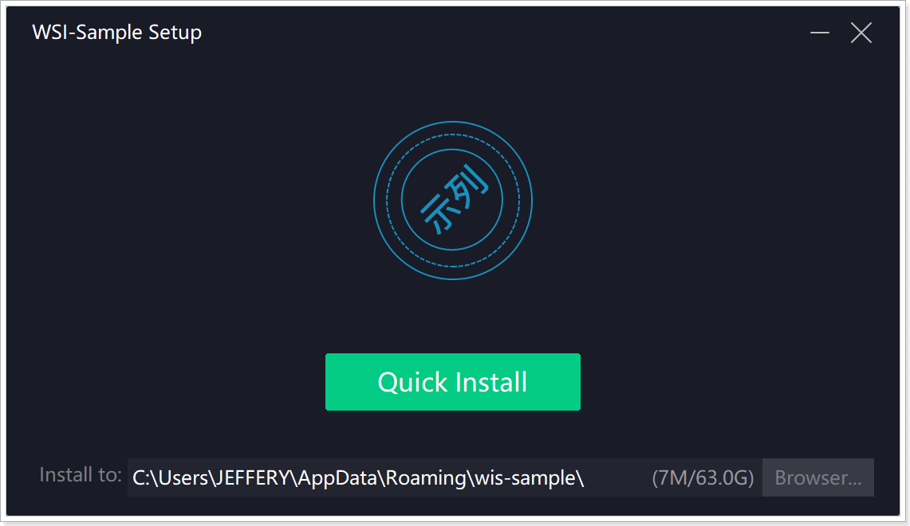
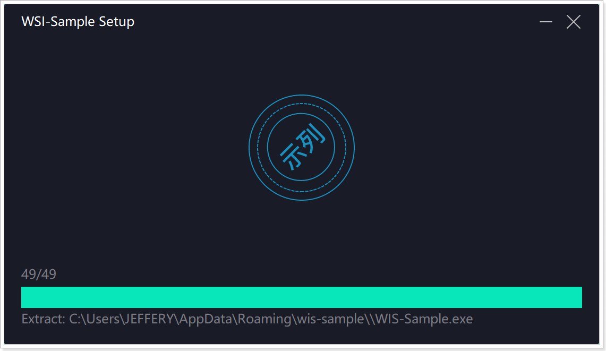
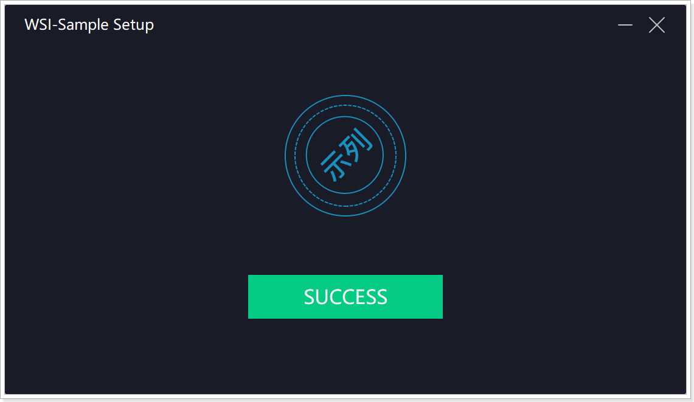
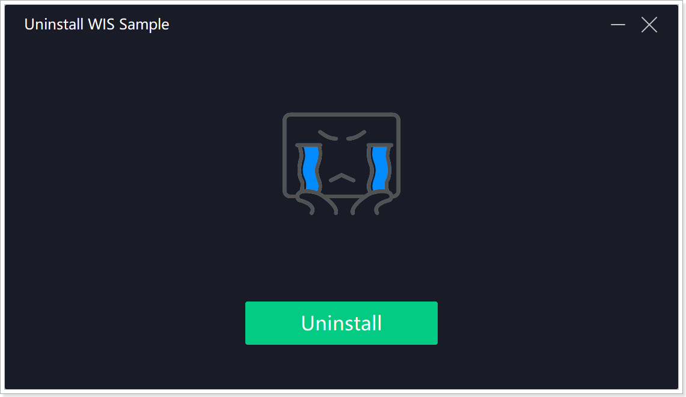
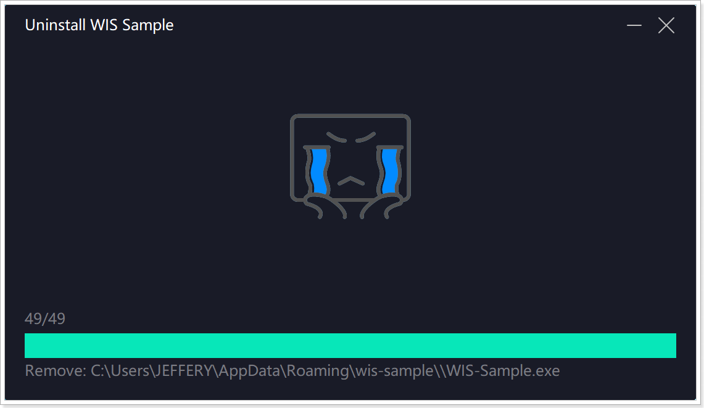
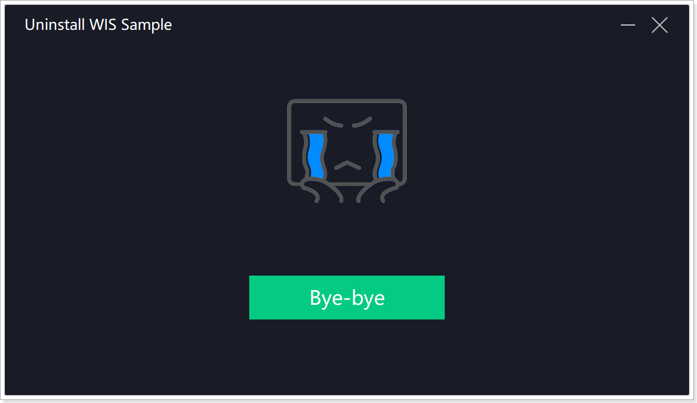

# 1. About
WIS (Windows Install System) is an open source system to create Windows installers.

---

## 2. Installer
## 2.1 Logo
```txt
<windows-install-system>\src\Installer\logo.ico
```

## 2.2 Files in installer
```txt
<windows-install-system>\src\Installer\AppFiles.zip
```

## 2.3 Installer.exe file version
```txt
<windows-install-system>\src\Installer\resource.h
```

## 2.4 [InstallerConfig.json](src\Install\InstallerConfig.json)
The InstallerConfig.json file is located on `<windows-install-system>\src\Installer\InstallerConfig.json`.
The config file supports for using predefined varibales(See [4.Predefined variable](#-4.-Predefined-variable)).


---

# 3. Uninstaller
## 3.1 Logo
```txt
<windows-install-system>\src\Uninstaller\UninstallerLogo.ico
```

## 3.2 Uninst.exe file version
```txt
<windows-install-system>\src\Uninstaller\resource.h
```

## 3.3 [UninstallerConfig.json](src\Uninstaller\UninstallerConfig.json)
The UninstallerConfig.json file is located on `<windows-install-system>\src\Uninstaller\UninstallerConfig.json`.
The config file also supports for using predefined varibales(See [4.Predefined variable](#-4.-Predefined-variable)).

---

# 4. Predefined variable
All of variables are defined in `Variable` project, Follow these rules:

> - Lowercase, no space, underline style.
> - Using %% for %.
> - All of directories end with `\`.

## 4.1 Variable List
- current_user_desktop
  
  The desktop directory of current user, such as `C:\Users\<User>\Desktop\`.

- all_user_desktop
  
  The desktop directory of common user, such as `C:\Users\Public\Desktop\`.

- current_user_programs
  
  The programs directory of current user, such as `C:\Users\<User>\AppData\Roaming\Microsoft\Windows\Start Menu\Programs\`.

- all_user_programs
  
  The programs directory of common user, such as `C:\Users\Public\AppData\Roaming\Microsoft\Windows\Start Menu\Programs\`.

- current_user_appdata
  
  The app data directory of current user, such as `C:\Users\<User>\AppData\`.

- all_user_appdata
  
  The app data directory of common user, such as `C:\Users\Public\AppData\`.

- install_folder
  
  Final installation directory.

- cur_fullname
  
  current installer file name(with file extension), such as `instaler_1.0.0.1.exe`.

- cur_filename

  current installer file name(without file extension), such as `instaler_1.0.0.1`.
  
- uninstaller_fullname
  
  Uninstaller exe file name(with file extension), such as `Uninst.exe`.
  
---

## 5. Command line parameter
Installer support these startup parameter:
- `/S`: silent install(no any UI or error message) 

```bash
WIS-Sample-Installer.exe /S
```

- `/D`: install folder

```bash
WIS-Sample-Installer.exe /D "D:\test folder\wis"
```

Uninstaller only support `/S` startup parameter.
  
## 6. Screenshot of sample
> **All UI elements can be customized.**

### 6.1 Installer UI






### 6.2 Uninstaller UI





